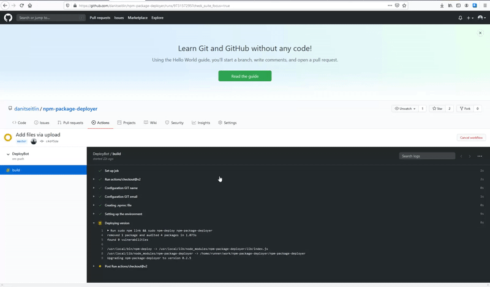

<h1 align='center'>NPM Deploy bot <g-emoji class='g-emoji' alias='point_right' fallback-src='https://github.githubassets.com/images/icons/emoji/unicode/1f449.png'>👉</g-emoji> Automate your deployment process!</h1>

  
  
  
  
  

## :zap: Quick Start
Run `npm install npm-package-deployer`
## :clap: Basic usage
Run `npm-deploy <package name>` to deploy an automatic version locally

## :fire: Integrate with GitHub actions
You can integrate this package with a GitHub action workflow (A full example can be seen [here](https://github.com/danitseitlin/dmock-server/blob/master/.github/workflows/auto-deployer.yml)):
1. Setup your git configuration
2. Create an .npmrc file with the NPM auth token
3. Add deploy script in your package.json for `npm-deploy <package name>`
4. Run deploy script

